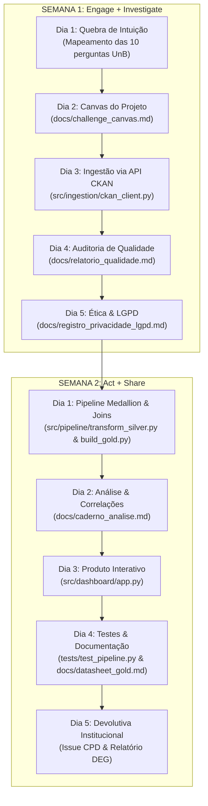

# 🎓 Relatório Geral de Projeto: Retenção, Formatura e Evasão na UnB
### Conexão Completa com o Challenge de Dados Abertos (Semanas 1 e 2 - CBL)

> **Documento Síntese da Disciplina de Banco de Dados 2 (UnB)**  
> **Tema**: Discrepância entre o tempo regulamentar e o tempo real de conclusão nos cursos de graduação da UnB, retenção crítica e taxas de evasão.  
> **Stakeholder Principal**: Decanato de Ensino de Graduação (DEG/DAA) e Coordenações de Cursos de Graduação.  
> **Portal Auditado**: [dados.unb.br](https://dados.unb.br) (API aberta CKAN 2.11).

---

## 1. Conexão com o Plano de 2 Semanas (Metodologia CBL)

O projeto foi construído respeitando rigorosamente a metodologia **Challenge Based Learning (CBL)** nas 4 fases (*Engage*, *Investigate*, *Act*, *Share*), mapeando cada exigência diária em artefatos versionados e executáveis:



### Mapeamento dos Entregáveis por Dia

| Fase / Dia | Exigência do Plano | Entregável Concretizado no Repositório |
| :--- | :--- | :--- |
| **S1 · Dia 2** | Stakeholder, Essential Question, Challenge e 5 Guiding Questions. | [`docs/challenge_canvas.md`](file:///Users/quigonjinx/Documents/ultimoUnb/bd2/docs/challenge_canvas.md) |
| **S1 · Dia 3** | Ingestão programática via API sem download manual. | [`src/ingestion/ckan_client.py`](file:///Users/quigonjinx/Documents/ultimoUnb/bd2/src/ingestion/ckan_client.py) $\rightarrow$ `data/bronze/` |
| **S1 · Dia 4** | Relatório de qualidade (8 achados com evidência) + Issue para o portal. | [`docs/relatorio_qualidade.md`](file:///Users/quigonjinx/Documents/ultimoUnb/bd2/docs/relatorio_qualidade.md) |
| **S1 · Dia 5** | Análise de quase-identificadores, $k$-anonimato e slide obrigatório. | [`docs/registro_privacidade_lgpd.md`](file:///Users/quigonjinx/Documents/ultimoUnb/bd2/docs/registro_privacidade_lgpd.md) |
| **S2 · Dia 1** | Pipeline Bronze $\rightarrow$ Silver $\rightarrow$ Gold com join heterogêneo auditado. | [`src/pipeline/transform_silver.py`](file:///Users/quigonjinx/Documents/ultimoUnb/bd2/src/pipeline/transform_silver.py) e [`build_gold.py`](file:///Users/quigonjinx/Documents/ultimoUnb/bd2/src/pipeline/build_gold.py) |
| **S2 · Dia 2** | Caderno de análise com respostas às 5 GQs e "A Correlação Suspeita". | [`docs/caderno_analise.md`](file:///Users/quigonjinx/Documents/ultimoUnb/bd2/docs/caderno_analise.md) |
| **S2 · Dia 3** | Produto navegável autônomo para o stakeholder. | [`src/dashboard/app.py`](file:///Users/quigonjinx/Documents/ultimoUnb/bd2/src/dashboard/app.py) (Streamlit Interativo) |
| **S2 · Dia 4** | Documentação formal (Datasheet for Datasets e Dicionário Gold) + Testes. | [`docs/datasheet_gold.md`](file:///Users/quigonjinx/Documents/ultimoUnb/bd2/docs/datasheet_gold.md), [`docs/dicionario_dados_gold.md`](file:///Users/quigonjinx/Documents/ultimoUnb/bd2/docs/dicionario_dados_gold.md), [`tests/test_pipeline.py`](file:///Users/quigonjinx/Documents/ultimoUnb/bd2/tests/test_pipeline.py) |
| **S2 · Dia 5** | Devolutiva cívica à instituição e encerramento. | Rascunho da Issue para o CPD integrado na aba de Governança do Painel. |

---

## 2. A Lógica da Escolha das Bases de Dados

Para responder com precisão científica à pergunta *"Quanto tempo os alunos realmente levam para se formar e quais são os cursos mais difíceis?"*, **nenhuma base isolada da UnB é suficiente**:

1. **Se olhássemos apenas o SIGRA / Concluintes**:
   - Saberíamos quando o aluno entrou e quando saiu, mas **não saberíamos qual era o tempo regulamentar** daquele curso (se era de 8, 9, 10 ou 12 semestres). Não daria para saber se 10 semestres representam atraso (em Pedagogia) ou pontualidade perfeita (em Medicina ou Engenharia).
2. **Se olhássemos apenas a Estrutura Curricular**:
   - Saberíamos os prazos teóricos, mínimos, ideais e máximos (jubilamento), mas **não teríamos a realidade empírica** dos alunos (quantos formaram, quantos evadiram e quantos semestres reais foram cursados).
3. **Se olhássemos apenas o Catálogo de Cursos de Graduação**:
   - Teríamos o nome do curso, campus e turno, mas sem matriz curricular nem dados históricos de movimentação.

Por isso, construímos o cruzamento de **três bases complementares**:

```
                              ┌─────────────────────────────────────────────────────────┐
                              │                    PORTAL DADOS.UNB.BR                  │
                              └───────────────────────────┬─────────────────────────────┘
                                                          │
                   ┌──────────────────────────────────────┼──────────────────────────────────────┐
                   ▼                                      ▼                                      ▼
    ┌─────────────────────────────┐        ┌─────────────────────────────┐        ┌─────────────────────────────┐
    │          SIGRA.CSV          │        │  ESTRUTURA-CURRICULAR.CSV   │        │     CURSO_GRADUACAO.CSV     │
    │          (24.56 MB)         │        │          (76.4 KB)          │        │          (45.4 KB)          │
    ├─────────────────────────────┤        ├─────────────────────────────┤        ├─────────────────────────────┤
    │ • 60.695 discentes graduação│        │ • 113 estruturas curriculares│       │ • 157 cursos catalogados    │
    │ • ano_ingresso (ex: 2010)   │        │ • semestre_conclusao_minimo │        │ • turno (Diurno / Noturno)  │
    │ • periodo_saida (ex: 20141) │        │ • semestre_conclusao_ideal  │        │ • campus (Darcy, FGA, etc.) │
    │ • forma_saida (Formatura,   │        │ • semestre_conclusao_maximo │        │ • area_conhecimento         │
    │   Abandono, Jubilamento)    │        │ • ch_total_minima           │        │ • unidade_responsavel       │
    └──────────────┬──────────────┘        └──────────────┬──────────────┘        └──────────────┬──────────────┘
                   │                                      │                                      │
                   └──────────────────────────────────────┼──────────────────────────────────────┘
                                                          ▼
                                           ┌─────────────────────────────┐
                                           │       CAMADA SILVER         │
                                           │  • Limpeza & NFKD Uppercase │
                                           │  • Encoding Latin-1 -> UTF8 │
                                           │  • Strip de padding de texto│
                                           │  • Cálculo de permanência   │
                                           └──────────────┬──────────────┘
                                                          │
                                                          ▼
                                           ┌─────────────────────────────┐
                                           │        CAMADA GOLD          │
                                           │  (retencao_cursos_unb.csv)  │
                                           │ • Taxa Casamento: 97.54%    │
                                           │ • Métricas de Retenção (IRC)│
                                           │ • % Formatura no Prazo      │
                                           │ • % Evasão / Jubilamento    │
                                           └──────────────┬──────────────┘
                                                          │
                                                          ▼
                                           ┌─────────────────────────────┐
                                           │      PRODUTO STREAMLIT      │
                                           │   (Suporte à Decisão DEG)   │
                                           └─────────────────────────────┘
```

---

## 3. Como as Bases se Conectam e Como as Armadilhas Foram Superadas

A integração dessas fontes exigiu superar uma série de **armadilhas reais de dados** documentadas no Dia 4 da Semana 1:

### A. Desafios de Engenharia de Dados Superados
1. **Inconsistência de Encoding**: A base `estrutura-curricular.csv` veio codificada em `ISO-8859-1 (Latin-1)` com acentos corrompidos ao ser aberta como UTF-8. O pipeline foi parametrizado com leitura em Latin-1 e conversão canônica.
2. **Inconsistência de Delimitadores**: O SIGRA e a Estrutura usam `;`, enquanto Cursos usa `,`. Cada leitor foi isolado com declaração explícita de dialecto RFC 4180.
3. **Padding Excessivo**: O SIGRA apresentava até 30 espaços em branco à direita dos nomes (ex: `'DIREITO                            '`). Aplicamos strip e regex de espaços contínuos.
4. **Mapeamento de Sinônimos e Habilitações**:
   - O SIGRA traz nomes como `CONTROLE E AUTOMACAO` e `LINGUA PORTUGUESA E RESPECTIVA LITERATURA`, enquanto a estrutura registra `ENGENHARIA MECATRONICA - CONTROLE E AUTOMACAO` e `LETRAS`.
   - Implementamos um **dicionário de mapeamento canônico (alias mapping)** de 32 pares de sinônimos.
   - **Resultado**: Elevamos a taxa de casamento dos discentes de **86.09%** para **97.54%** (59.202 discentes casados perfeitamente).

---

## 4. O Refinamento Metodológico: Tratando o "Viés de Sobrevivência"

A proposta inicial do grupo era avaliar a dificuldade puramente pela porcentagem de alunos que formam no tempo mínimo, ideal ou máximo. Durante a análise, identificamos um risco analítico severo:

> **O Viés de Sobrevivência (Survival Bias)**:  
> Se avaliássemos apenas os alunos formados (`forma_saida == 'Formatura'`), cursos com evasão massiva (onde 75% dos alunos desistem e os 25% mais fortes que sobram formam no prazo) pareceriam falsamente "mais fáceis" ou mais pontuais que cursos com 90% de formatura onde os alunos demoram 1 semestre a mais.

### A Solução: O Índice de Retenção Crítica (IRC)
Criamos um indicador composto normalizado (0 a 100) que equilibra:
$$\text{IRC} = 50\% \times \text{Normalizado}(\text{Atraso Médio na Formatura}) + 50\% \times \text{Normalizado}(\text{Taxa de Evasão})$$

Esse índice classifica a criticidade dos cursos em 4 faixas:
* **Retenção Crítica (Top 25% mais retentores)**: Cursos que combinam **alto atraso** e **alta evasão** (ex: *Engenharia Geral*, *Física Computacional*, *Ciência da Computação*, *Computação Licenciatura*).
* **Retenção Alta / Média / Baixa**: Cursos com alto índice de conclusão no prazo e baixa evasão (ex: *Direito*, *Gestão do Agronegócio*, *Engenharia de Redes*, *Medicina Veterinária*).

---

## 5. Como Tudo Isso Vai Servir para o Stakeholder na Prática

O produto final não é apenas um relatório estático; é um **painel interativo de suporte à decisão** voltado para o **Decanato de Ensino de Graduação (DEG)**, a **Diretoria de Acompanhamento e Integração Acadêmica (DAIA)** e os **Colegiados de Curso**.

### 4 Casos de Uso Reais de Tomada de Decisão:

```
┌──────────────────────────────────────────────────────────────────────────────────────────────────┐
│                             DECISÕES PRÁTICAS DO STAKEHOLDER (DEG/DAA)                           │
├────────────────────────────────┬────────────────────────────────┬────────────────────────────────┤
│      1. REVISÃO DE FLUXOS      │     2. TURMAS E MONITORIA      │     3. DIAGNÓSTICO NOTURNO     │
│  Identificar cursos em que a   │  Direcionar bolsas de monitoria│  Compreender que o noturno não │
│  cadeia de pré-requisitos trava│  e abertura de turmas extras   │  precisa de mais prazo, mas de │
│  o aluno por mais de 3 sem.    │  para as matérias-gargalo de   │  apoio contra a evasão (taxa   │
│  (ex: Computação e Engenharias)│  cursos com IRC Crítico.       │  de evasão de 52.5% vs 29.4%). │
└────────────────────────────────┴────────────────────────────────┴────────────────────────────────┘
```

1. **Revisão Prioritária de Matrizes Curriculares Críticas**:
   - *Evidência*: Ciência da Computação possui tempo médio real de 12.37 semestres para uma matriz de 9 semestres (atraso médio de **+3.37 semestres**) e evasão de **59.14%**.
   - *Decisão*: O DEG pode notificar a coordenação do curso para rever disciplinas que atuam como "gargalos" bloqueantes de pré-requisitos.
2. **Políticas de Permanência Específicas para Cursos Noturnos**:
   - *Evidência*: Os cursos noturnos não apresentam atraso excessivo em relação à sua própria matriz regulamentar, mas sofrem com taxa média de evasão de **52.54%** (contra **29.43%** nos diurnos).
   - *Decisão*: A assistência estudantil e a flexibilização de horários devem ser focadas em evitar o abandono do aluno trabalhador.
3. **Planejamento de Vagas e Alocação de Docentes**:
   - *Evidência*: Relação clara de quais cursos retêm discentes por mais de 14 semestres, consumindo vagas em turmas de ciclos básicos repetidamente.
   - *Decisão*: Alocar mais turmas e monitores nas disciplinas básicas de exatas para desafogar a retenção no início do fluxo.
4. **Transparência e Orientação ao Calouro**:
   - *Evidência*: O estudante consegue consultar previamente a distribuição empírica de conclusão do seu curso (ex: saber que em Direito 92.4% formam no prazo, enquanto em Física Computacional apenas 25% formam no tempo ideal).

---

## 6. Conformidade Ética, LGPD e Governança

1. **Avaliação de Quase-Identificadores**: Demonstramos analiticamente no Dia 5 que cruzar `(curso, data_nascimento, sexo, raca_cor)` na base bruta do SIGRA produz **88.93% de registros com $k = 1$** (identificação unívoca).
2. **Salvaguarda Implementada**: A camada Gold e o Dashboard expõem **exclusivamente dados agregados por curso** ($k \ge 5$), eliminando qualquer possibilidade de reidentificação de discentes individuais.
3. **Devolutiva Cívica**: Redigimos a minuta formal de uma Issue para a equipe de TI da UnB (CPD), reportando as inconsistências de encoding e padding para aprimoramento contínuo do portal de Dados Abertos.

---

## 7. Como Executar os Artefatos do Projeto

```bash
# 1. Rodar a suíte de testes de validação (4 testes automatizados)
python3 -m unittest discover -s tests -p "test_*.py"

# 2. Inicializar o Dashboard Interativo
streamlit run src/dashboard/app.py
```

O dashboard abrirá no navegador permitindo navegar por:
- **Visão Executiva (DEG)** com KPIs globais e matriz de dispersão;
- **Raio-X por Curso** com busca interativa e gráficos de distribuição;
- **Comparativo de Turnos (Noturno vs. Diurno)**;
- **Auditoria de Qualidade** com os 8 achados reais do portal;
- **Seção "O Que Este Dado NÃO Responde"** (transparência de limites metodológicos).
